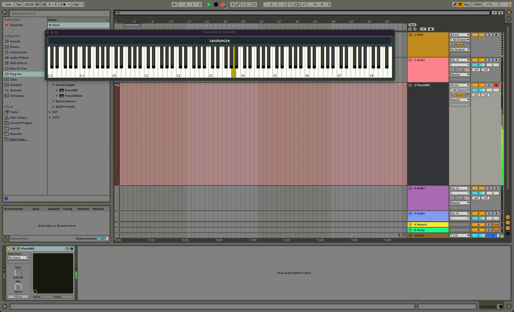

# Piano960

Piano960 is a cross platform audio plugin: a virtual instrument that randomly assigns a unique, random sample to each key on a MIDI keyboard.

__This is a work in progress.__



---

<div align="center">
  <b> Here's a short audio clip demonstrating one example of what the instrument can sound like. </b>
  <br>
  <br>
</div>

https://user-images.githubusercontent.com/19389561/207800053-8ebb1fd1-1be0-4011-ad29-069673584649.mp4

---

## Supported Formats:
- [AU](https://en.wikipedia.org/wiki/Audio_Units)
- [VST](https://en.wikipedia.org/wiki/Virtual_Studio_Technology)
- [VST3](https://en.wikipedia.org/wiki/Virtual_Studio_Technology)

## Building the Plugin

To quickly build and install Piano960, use the `build.sh` convencience script with an `-i` option.

```
bash ./build.sh -i
```

or, to build/install the plugin manually with cmake:

```bash
mkdir build && cd build
cmake .. -DCMAKE_INSTALL_PREFIX=/usr/local
make install
```

## Unit Testing

Use `build.sh` with a `-t` option to build and run the unit tests.

```bash
Piano960 % bash ./build.sh -t
[ 78%] Built target Catch2
[ 95%] Built target Piano960Plugin
[ 96%] Building CXX object Tests/CMakeFiles/unit-tests.dir/pitch_detection_tests.cpp.o
[ 97%] Building CXX object Tests/CMakeFiles/unit-tests.dir/processor_test.cpp.o
[ 98%] Linking CXX executable unit-tests
[100%] Built target unit-tests
Randomness seeded to: 4098072686
===============================================================================
All tests passed (32 assertions in 28 test cases)
```

## Samples

Samples are randomly compiled from [Piano960-Sample-Sets](https://github.com/perintyler/Piano960-Sample-Packs/tree/3cd9a87cd744546126fbd789f81a77e3cdff23df) to the [`Resources`](https://github.com/perintyler/Piano960/tree/main/Resources) directory via the [`compile_samples.py` script](https://github.com/perintyler/Piano960/blob/main/Scripts/compile_samples.py). Any set of samples and sample packs can be used by using the script's `--sample-packs` argument.

```bash
python3 Scripts/compile_samples.py --sample-packs path/to/my/samples
```

There's a bunch of sample manipulation scripts in the `Scripts` directory:
- `clean_packs.py`: this script will cleanse sample packs of non `.wav` files
- `compile_samples.py`: this script will crawl through a nested directories structure, finding wav files to popule the `Resouces` folder
- `compile_test_data.py`: this is a convenience script for finding/naming/saving audio files that can be used for unit tests
- `trim_samples.py`: this script trims every installed sample to a fixed length
- `normalize_samples`: this script makes sure that the volume levels of each installed sample is about the same


## Pitch Detection

The plugin uses the [YIN algorithm](http://audition.ens.fr/adc/pdf/2002_JASA_YIN.pdf) to detect the natural frequency of samples, which is neccessary when assigning random samples to MIDI keys, since each key must produce a specific pitch, meaning the sample must be transposed.

As of now, the plugin will successfully identify the correct note of a sample (i.e. A, A#, B, ...), but won't always be able to identify the correct octave of the sample. A couple of the unit tests are still failing. This is a work in progress.
